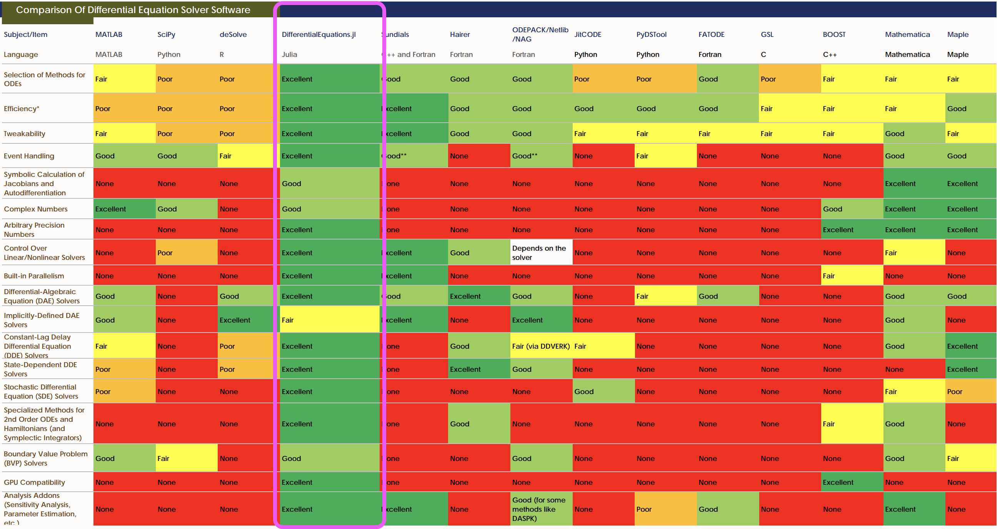

 <!-- .element height="10%" width="10%" -->

# Julia

A new programming language *specifically* made for scientists and engineers


Note: ~5 years ago at MIT

----

## A bit about me:

- PhD in Immunology (no coding prior to 2014)
- Tried julia as my first language when it was `v0.3`
- During 1st postdoc, built a python package to look for HGT
- Over the past 1.5 years, work almost entirely in julia ([Microbiome.jl](https://github.com/BioJulia/Microbiome.jl))

---

# Why Julia?

---

## The two language problem

1. Brain-storm in a dynamic language for algorithm exploration and testing.
2. Deliver a performant final-version in a compiled language.

Note: Most compiled programs had a testing stage in a dynamic language

----

## Using dynamic languages

```none
Does a package/library do exactly
what you need?
             ├── Yes:   Great!
             ├── Dunno: You need to read C/++ code.
             └── No:    You need to code in C/++.
```

Note: R, Python, and MATLAB are coded mostly in C/++. Anything that is fast in those languages is coded in C/++.

----

## What if the dynamic language was fast enough?

* [Benchmarks](https://julialang.org/benchmarks/)
* Solves the two-language problem
* `Julia` is mostly coded in `Julia`!

Note: Julia is mostly coded in Julia!


----


## LOC versus speed


Note:
"Mash: fast genome and metagenome distance estimation using MinHash" used MinHashing -- a fast algorithm for comparing two sets of things -- for DNA sequence comparison. They implemented it in C for speed. Someone else made python bindings to the compiled C version. But I implemented it directly in Julia and made it super fast in under 100 lines of very readable code.

----

## Case Study: PDE Solvers


[ref](http://www.stochasticlifestyle.com/comparison-differential-equation-solver-suites-matlab-r-julia-python-c-fortran/): Christopher Rakaukas

---

# Dynamic & fast, how?

1. Just-in-time compilation (JIT): User-level code is compiled to machine code on-the-fly.
2. Meticulous type system: Designed to maximize impact of JIT.
3. Multiple dispatch: Function dispatch determined at compile time when possible, run time when not.

Note: JIT compilation times are slow for first run


---

# Easy code

Looks like `Python`/`MATLAB`/`R` but with prettier syntax.


----

## Syntax

<section style="text-align: left;">
Math:
```julia
2π√3/5α₀
```
`Python`:
```python
2*np.pi*np.sqrt(3)/(5*alpha0)
```
`Julia`:
```julia
2π*√3/5α₀
```

Note: Unicode characters, degree symbol, Greek letters, square root, units. Easy to read and understand, scientists are not programmers.

----

## Custom infix operators

```julia
# rotate coordinate `c` by `θ` radians
julia> ↺(c, θ) = [cos(θ) -sin(θ); sin(θ) cos(θ)]*c
↺ (generic function with 1 method)

julia> [1,0] ↺ π/2
2-element Array{Float64,1}:
 0.0
 1.0
```

Note: This opens the door to tons of cool syntax.

----

## Embedded units

It took a beetle 36 seconds to walk 25 cm. How many days will it take it to walk 3 km?

```julia
using Unitful:uconvert, cm, km, s, d
v = 25cm/36s
t = 3km/v
uconvert(d, t)
```
5 days

Note: if you use m, cm, feet, degrees, radians, etc

---

# Missing

The concept of `missing` and `NaN` is treated correctly:
```julia
julia> NaN + 1          = NaN

julia> missing + 1      = missing

julia> true |  NaN        ERROR!

julia> true | missing   = true

julia> false | missing  = missing

julia> true & missing   = missing

julia> false & missing  = false
```

Note: Consider that no other language has managed to get this concept of missing data correctly into their code.

----

## Compare to nothing

"The software engineer's Null"
```julia
julia> isa(nothing, Nothing)    = true

julia> nothing + 1              ERROR!

julia> true | nothing           ERROR!

julia> false & nothing          ERROR!
```

---

# Zero overhead

Full access to all the libraries and functionalities you already know.

`MATLAB.jl`, `RCall.jl`, `PyCall.jl`, `JavaCall.jl`, `Mathematica.jl`, and `ccall` keyword to call `C` (and other languages, like `Fortran` and `Rust`)

Note: you can call Julia home without losing all of your furniture in the move.


---

# Reproducible science

- New package system keeps track of the state of your entire stack
- Version control on `Manifest` ensures reproduction of environment
    - Just `git clone` and `instantiate`
- [DataDeps.jl](https://github.com/oxinabox/DataDeps.jl) for large datasets


----

## Some of my favorite (software) things

* [BioJulia org](https://github.com/BioJulia): Lots of stuff for (efficiently) working with biological data.
* [Images](https://github.com/JuliaImages/Images.jl) & [Colors](https://github.com/JuliaGraphics/Colors.jl): Treat colors as a unit.
* `github` integration:
    - your code and its documentation accessible to everyone
    - automatically tested on multiple architectures, with coverage reports.

Note: Many many more, but it's outside the scope of this presentation, CI

----

## My favorite thing: The community

* Core developers and community are always hashing stuff out. Focus on
    - correctness
    - clarity
    - usability
* [Discourse](https://github.com/BioJulia) (forum), [Slack](https://julialang.slack.com/) (chat), GitHub
- I adapted this slideshow from [Yakir Luc Gagnon](https://github.com/yakir12) from Duke U. ([discourse thread](https://discourse.julialang.org/t/preaching-julia-to-biologists/15058))

---

# Free & open source

* Easy to share and collaborate with *anyone*
* Drives the language forward
* Highly specialized and niche solutions and tools
* Free from hardware requirements
* No "black boxes", everything is within reach
* Razor thin gap between user and developer


Note: This is true for Python and R, but not MATLAB. Julia got git integration really well.

---

# Disadvantages
Mostly it's just too new…

Note: nothing is perfect.

----

## Too new!

* Ecosystems (e.g. packages, IDEs, debugger) not as mature as in other environments.
* Some of the more specialized libraries are missing.
* Harder to Google for answers (but Slack!)

Note: IDE (Integrated Development Environment). Maybe in 6 months or so the environment will solidify completely.

----

## Still working out all the kinks

* Loading some packages is still a bit slow.
* Plotting works but hasn't settled yet.
* Transitioning into `v1.0.0`: Major changes.

----

## Julia is probably not the best choice for

* Web development.
* "Hello, World!" scripts (or short scripts in general).
* People who expect speed w/o work.

---

# Conclusions

* `Julia` is considered by many one of the best dynamic languages out there.
* A number of libraries already far out-perform their equivalents in other languages.
* People come to `Julia` because of its speed, but stay for the type-dispatch system ♥
* Suffers from being "too new": might not be suitable for early adopters.

Note: I've started using Julia about 4 years ago and never looked back.


---

<!-- .slide: data-background-color="#ffffff" -->

 <!-- .element height="100%" width="100%" -->
